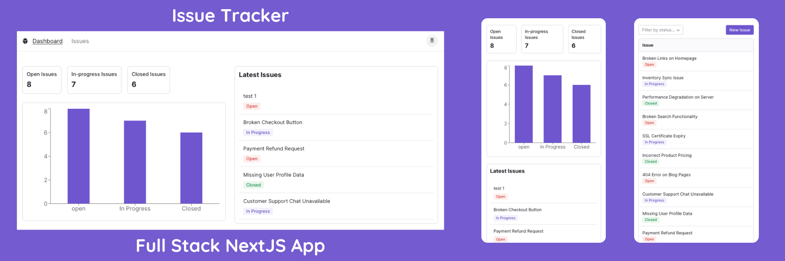

# Issue Tracker



## Description:

- A mordern Full-stack NextJS Application **Issue Tracker** that allow users to manage, maintain, create, update their issues during development.
- App Production Demo: https://issue-tracker-no-issue.vercel.app/

## Business Perspective:

- This is a side project (Shopify Application with NextJS) for a medium-size beauty company (based in New York City) who wants to manage customer support in one place.
- Intergration with Shopify to manage orders and customers, improve the customer experience when they need support.

## Main Tech-stack:

- NextJS, TailwindCSS, Prisma, MySQL

- Other tools:
  - Zod: form and request validation (both Frontend and backend)
  - Axios: fetching API
  - SimpleMDE: basic markdown interface
  - ReChart: chart, sumnmary dashboard
  - Radix UI and Next UI: front end development
  - Shopify / Shopify APIs: to manage customers and orders
  - Vercel: deployment
  - Planet Scale: database deployment
  - Google Cloud Console: Next Auth integration
  - React Email: writing emails

## Core Features:

- [DONE] ISSUE: View Create, update, delete issues
- [DONE] QUESTION: Vew, create, update, delete questions
- [DONE] Dashboard: Chart, Summary
- SETTING: Conffigure and connect to Shopify by Shopify APIs

## Advanced Features:

- [DONE] Authentication And Authorization with Next Auth (OAuth 2.0)
- [DONE] Assign users, admin pannel
- [DONE] When an issue is assigned to a user, automatically set the status to IN_PROGRESS.
- [DONE] On the Issue Detail page, add a drop-down list for changing the status of an issue
- [DONE] Implement a support page that allow customers submit an issue, then show them on the Issue List
- [DONE] Implement sending confirmation email to customer
- [DONE] Implement sending notification email to admin
- [DONE] Implement a descending sort on the Issue List page.
- Search issues
- Search questions
- Add a drop-down list to select the page size.
- Implement the ability to filter issues by assignee.
- Introduce a feature to add comments below an issue.
- Integration with Shopify Admin API to handle orders, customers

## Refactor:

- DeleteIssueButton and DeleteQuestionButton to a single reusable DeleteButton components

## Development Getting Started

First, run the development server:

```bash
npm run dev
# or
yarn dev
# or
pnpm dev
```

Open [http://localhost:3000](http://localhost:3000) with your browser to see the result.
